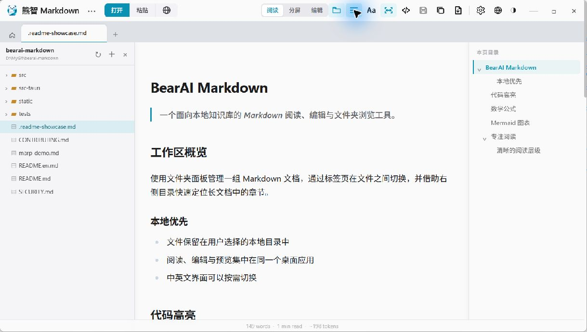
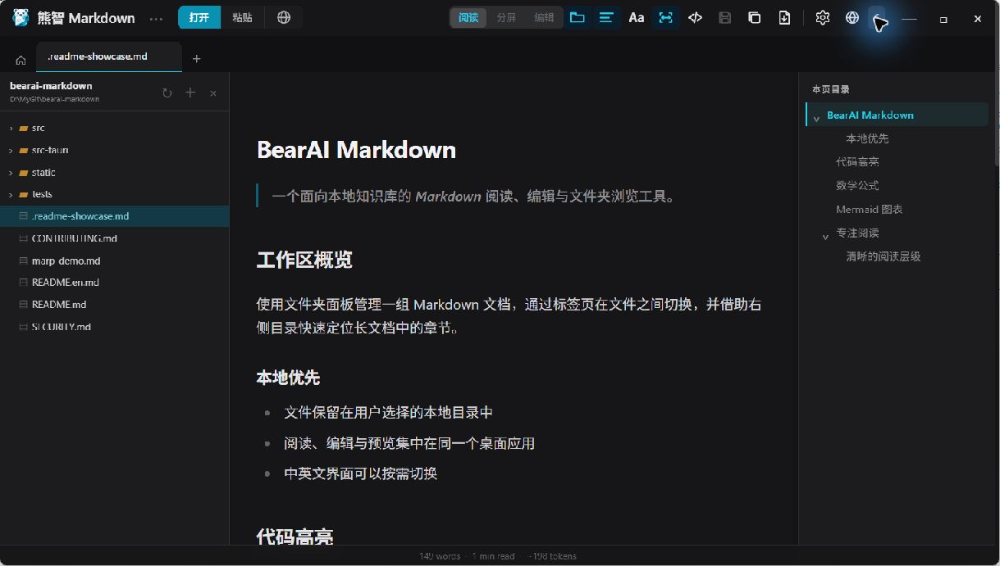
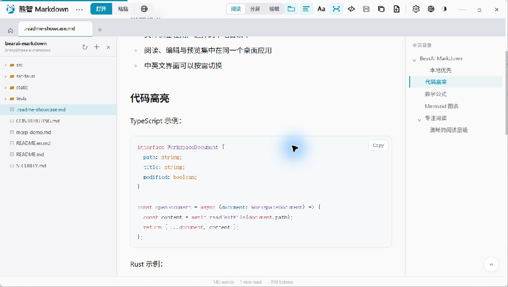
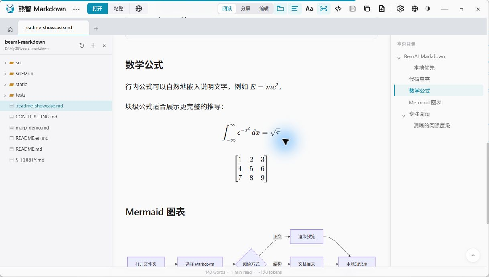
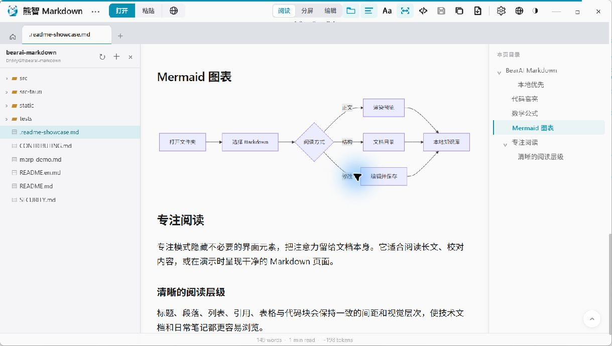
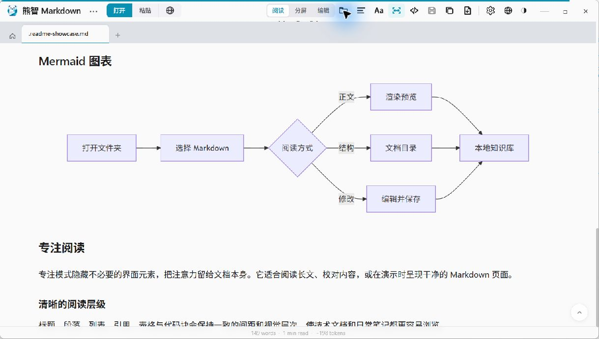

<div align="center">

# BearAI Markdown

### 熊智 Markdown

**A local Markdown reader, editor, and folder browser**

Open local Markdown files and knowledge-base folders, then read, edit, search, and organize them without moving your content into a proprietary database.

[](LICENSE)


[](https://tauri.app)

[GitHub](https://github.com/bearaicn/bearai-markdown) · [Gitee](https://gitee.com/bearaicn/bearai-markdown) · [简体中文](README.md) | English

</div>

> [!IMPORTANT]
> BearAI Markdown is derived from [MDHero](https://github.com/vaibhavuk-dev/mdhero),
> an open-source project created by [Vaibhav Kakde](https://github.com/vaibhavuk-dev)
> and distributed under the MIT License. MDHero established essential foundations including
> Markdown rendering, reading, editing, file opening, and multiple tabs. BearAI Markdown
> continues from that foundation with independent interface design and additional features.
> The original copyright notice and full MIT terms remain in [LICENSE](LICENSE).

## Why BearAI Markdown

Markdown is common across software development, writing, and AI workflows: READMEs,
development plans, exported conversations, journals, notes, and documentation can all live
as durable plain-text files. Code editors focus on source code, web viewers often require an
upload, and single-file readers do not provide enough context for a larger folder of knowledge.

BearAI Markdown brings these tasks into a straightforward local desktop tool:

- Files remain in directories controlled by the user.
- Documents can be read comfortably and edited in place when needed.
- A folder can be opened and browsed instead of handling only isolated files.
- Recent files and folders make it easy to continue previous work.
- Tabs, a table of contents, search, and reading progress help with longer documents.
- Markdown compatibility remains central while leaving room for local search and optional AI assistance.

Markdown remains in the product name because it accurately describes the primary format and purpose of the tool.

## Why continue from MDHero

MDHero already provides a reliable foundation for Markdown reading and lightweight editing,
including the desktop application structure, rendering pipeline, multiple tabs, search, syntax
highlighting, math, Mermaid, file watching, and saving changes back to the original file. BearAI
Markdown builds on that work to reuse and respect proven capabilities, while concentrating effort
on concrete gaps in its own workflow instead of rebuilding a Markdown engine from scratch.

The MDHero upstream baseline used to start this project had three important limitations for a
personal knowledge-base workflow:

1. **No folder workspace** — the original application primarily worked with individual files,
   recent files, and fixed folder entry points. It could not open an arbitrary knowledge-base
   folder as a persistent hierarchical browser, and it had no recent-folders workflow.
2. **No multilingual application UI** — interface text was primarily English, with no language
   switcher and no centralized, configurable locale resources for users or contributors to extend.
3. **No collapsible TOC hierarchy** — the table of contents could navigate to headings, but its
   entries were presented as a flat list. Parent and child headings could not be collapsed, and
   users could not choose the default expansion depth when opening a document.

BearAI Markdown is therefore more than a rename and icon replacement. It independently adds a
folder workspace and recent folders, Chinese and English UI backed by extensible locale resources,
and a hierarchical TOC with per-branch collapsing and configurable default depth. These additions
make the tool better suited to opening a local Markdown knowledge base while preserving MDHero's
established reading and editing experience.

## Features

### Folders and local knowledge bases

- **Open Folder** — select a local knowledge base or ordinary directory and browse its Markdown files.
- **Directory Tree** — expand nested folders and open `.md`, `.markdown`, `.mdown`, and `.mkd` files.
- **Recent Folders** — reopen recently used folders from the home screen.
- **Recent Files** — continue reading or editing recent documents with per-file reading progress.
- **Folder Panel** — show or hide the folder browser independently of the document table of contents.
- **Local First** — read and save the original files without importing them into a proprietary content store.

### Reading

- **Polished Rendering** — typography and spacing designed for longer documents, with light and dark themes.
- **Syntax Highlighting** — more than 25 languages through highlight.js.
- **Math** — inline and block equations, including matrices, rendered with KaTeX.
- **Mermaid Diagrams** — flowcharts, sequence diagrams, class diagrams, and more.
- **Extended Markdown** — tables, task lists, quotations, and other common constructs.
- **Reader Controls** — adjust font size, line height, and content width.
- **Zen Mode** — distraction-free full-screen reading.
- **Image Lightbox** — enlarge images and navigate with the keyboard.
- **Print and PDF** — print-friendly document output.
- **RTL Content** — basic support for right-to-left document sections.

### Table of contents and navigation

- **Multiple Tabs** — open several documents, switch between them, reorder them, or close them.
- **Table of Contents** — generate navigation from headings and track the active section.
- **Collapsible Headings** — expand or collapse each table-of-contents branch.
- **Default TOC Depth** — choose how many heading levels start expanded.
- **In-document Search** — find and highlight matches in the active document.
- **Keyboard Navigation** — shortcuts such as `j`, `k`, `gg`, `G`, `[`, and `]`.

### Editing

- **Built-in Editor** — switch between reading, split, and editing modes.
- **Save Original Files** — write changes back with `Ctrl+S` or `Cmd+S`.
- **Unsaved State** — show dirty indicators and confirm before closing unsaved documents.
- **Per-tab State** — preserve editing content and position when switching documents.
- **File Watching** — reload files changed by external editors, including common atomic-save workflows.

### Opening and importing

- **Local Files** — use the open dialog, drag and drop, or the operating system's Open With command.
- **Open URL** — fetch public Markdown from GitHub, Gist, GitLab, Bitbucket, or another public URL.
- **Paste Mode** — render Markdown copied from an AI conversation or another tool.
- **Claude Code Plans** — discover plan files under `~/.claude/plans/`.
- **File Associations** — register common Markdown filename extensions.

### Desktop experience

- **Custom Title Bar** — integrate window controls into the application toolbar.
- **Application Menu** — keep essential commands for new, open, find, fullscreen, settings, updates, about, and quit.
- **Chinese and English UI** — switch between Simplified Chinese and English.
- **Configurable Locale Resources** — translations are centralized so more languages can be added.
- **Light and Dark Themes** — switch the interface theme from the toolbar.
- **BearAI Icon** — consistent branding for the application window and platform icon resources.

### Sharing and output

- **Copy Rich Text** — paste rendered content into applications that accept rich text.
- **Copy Markdown** — copy the original Markdown source.
- **Export PDF** — create a shareable PDF through the print workflow.

## Screenshots

The following screenshots come from the current BearAI Markdown desktop application. They use
an isolated showcase document to demonstrate the workspace, rendering features, and reading
layout without exposing any user knowledge-base data.

<table>
<tr>
<td></td>
<td></td>
</tr>
<tr>
<td align="center"><em>Light workspace: folder, document, and TOC</em></td>
<td align="center"><em>Dark workspace: folder, document, and TOC</em></td>
</tr>
</table>

### Syntax highlighting



### KaTeX math rendering



### Mermaid diagrams



### Focused reading layout



## Installation

BearAI Markdown is currently establishing its independent product baseline and release process.
There is no official public binary download yet. Do not treat an upstream MDHero release as a
BearAI Markdown installer.

Run from source:

```powershell
pnpm install
pnpm tauri dev
```

Build a local installer:

```powershell
pnpm tauri build
```

Official download links will be added after the independent signing and release workflow is ready.

## Keyboard shortcuts

| Windows / Linux | macOS | Action |
|---|---|---|
| `Ctrl+O` | `Cmd+O` | Open a file |
| `Ctrl+Shift+V` | `Cmd+Shift+V` | Paste Markdown |
| `Ctrl+T` | `Cmd+T` | New tab |
| `Ctrl+W` | `Cmd+W` | Close the active tab |
| `Ctrl+1..9` | `Cmd+1..9` | Switch to tab N |
| `Ctrl+F` | `Cmd+F` | Find in document |
| `Ctrl+E` | `Cmd+E` | Toggle edit mode |
| `Ctrl+S` | `Cmd+S` | Save the file |
| `Ctrl+U` | `Cmd+U` | Toggle raw Markdown view |
| `Ctrl+Shift+F` | `Cmd+Shift+F` | Zen mode |
| `Ctrl+=` / `Ctrl+-` | `Cmd+=` / `Cmd+-` | Zoom in or out |
| `Ctrl+0` | `Cmd+0` | Reset zoom |
| `j` / `k` | `j` / `k` | Scroll down or up |
| `gg` / `G` | `gg` / `G` | Jump to the top or bottom |
| `[` / `]` | `[` / `]` | Previous or next heading |
| `/` | `/` | Open search |

## Development

### Requirements

- Node.js 22+
- pnpm 10+
- Stable Rust toolchain
- Windows: MSVC Build Tools and the WebView2 environment required by Tauri
- macOS: Xcode Command Line Tools

### Commands

```powershell
pnpm install          # Install frontend dependencies
pnpm test             # Run frontend unit tests
pnpm check            # Run Svelte and TypeScript checks
pnpm build            # Build frontend static assets
pnpm tauri dev        # Run the real Tauri desktop application
pnpm tauri build      # Build desktop installers
```

The development server uses port `1420`.

### Stack

- [Tauri v2](https://tauri.app) — Rust desktop backend and native window integration
- [SvelteKit](https://kit.svelte.dev) — frontend using Svelte 5 runes
- [markdown-it](https://github.com/markdown-it/markdown-it) — Markdown rendering pipeline
- [highlight.js](https://highlightjs.org) — syntax highlighting
- [KaTeX](https://katex.org) — mathematical notation
- [Mermaid](https://mermaid.js.org) — diagram rendering
- [Tailwind CSS v4](https://tailwindcss.com) — selected interface styling utilities

## Privacy and local data

BearAI Markdown is built around local files:

- No account is required.
- Markdown files are read, rendered, and edited locally by default.
- No product analytics or behavior tracking is included.
- Network access occurs when the user explicitly opens a URL.
- Version checks use only the BearAI Markdown GitHub Releases API. The upstream updater endpoint
  and signing key have been removed. Automatic in-app installation remains disabled until BearAI
  has its own signing key.

For compatibility with existing development data, some internal local-storage keys and the Tauri
identifier still contain `mdhero`. They are not displayed as product branding. A future identifier
change must migrate recent files, recent folders, settings, and reading progress first.

## Origin and acknowledgements

BearAI Markdown does not claim new authorship over its upstream foundation. It is an independent
derivative tool developed under the permissions of an open-source license.

- **Original product:** [MDHero](https://github.com/vaibhavuk-dev/mdhero)
- **Original author:** [Vaibhav Kakde](https://github.com/vaibhavuk-dev)
- **Original license:** [MIT License](LICENSE)
- **Upstream foundation:** Markdown rendering, the desktop application structure, file opening,
  multiple tabs, search, math, Mermaid, syntax highlighting, editing, saving, and file watching.
- **BearAI Markdown additions:** BearAI branding and icons, a custom title bar, folder workspace,
  recent folders, Chinese and English UI, a collapsible table of contents, configurable default
  TOC depth, and continued work toward personal knowledge management.

Thank you to Vaibhav Kakde and every MDHero contributor for choosing open source and making further
learning, modification, and independent development possible.

## Contributing

Contributions should:

- Preserve the local-first model and protect user data.
- Keep the original copyright notice and MIT license.
- Include test, build, or real desktop verification evidence for behavior changes.
- Separate generally useful upstream fixes from BearAI Markdown-specific product changes when practical.

See [CONTRIBUTING.md](CONTRIBUTING.md) for detailed development guidance.

## License

This project is distributed under the [MIT License](LICENSE).

Original copyright notice:

```text
Copyright (c) 2026 Vaibhav Kakde
```

See [LICENSE](LICENSE) for the complete terms.
